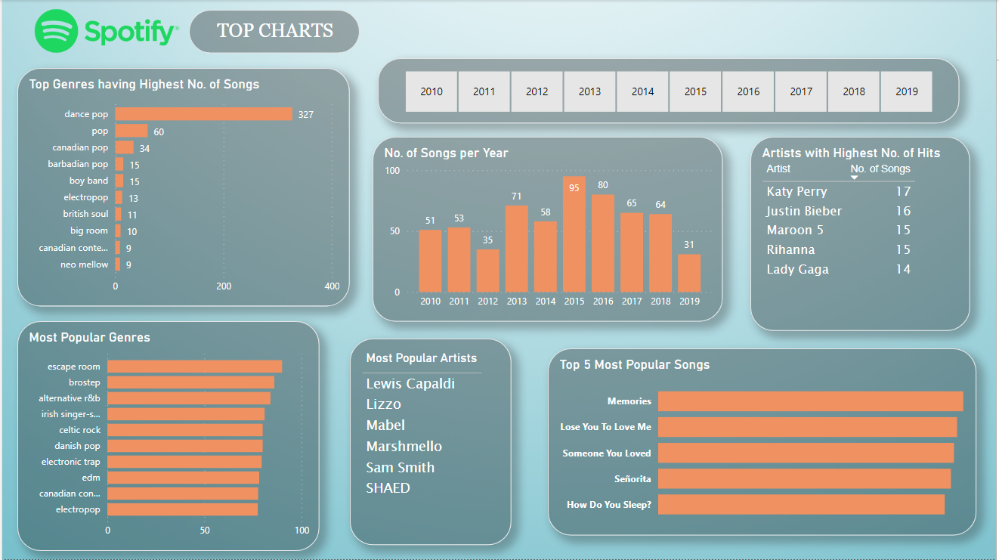

# Spotify Top Charts Analysis

This project includes Exploratory Data Analysis and Visualization of "Spotify Top Charts Songs" from year 2010 to 2019. (Using Python, Excel and PowerBI)

- *Collecting Data* - of Spotify Top Hit Songs from Year 2010 to 2019.
- *Cleaning the Data* - using *Python* libraries like Pandas and Numpy (removing/replacing null values if any, dropping unnecessary columns, renaming columns to make sense to the reader)
- *Exploratory Data Analysis (EDA)* - 
    - Finding correlations between different factors of the song.
    - Building Charts and Plots using *Seaborn and Matplotlib* libraries.
    - Finding Top Artists, Genres & Songs through different years.
- *Building a stunning Dashboard* - using *PowerBI* to showcase the analysis.
## Dashboard

